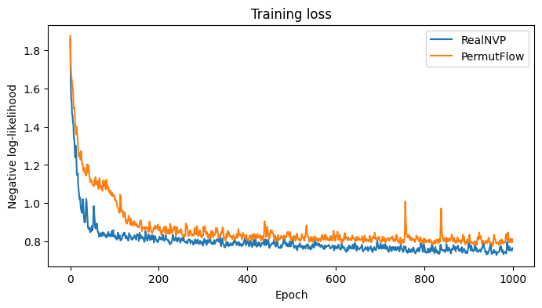
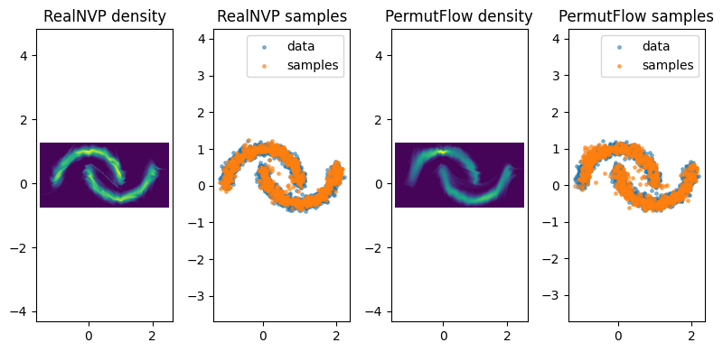
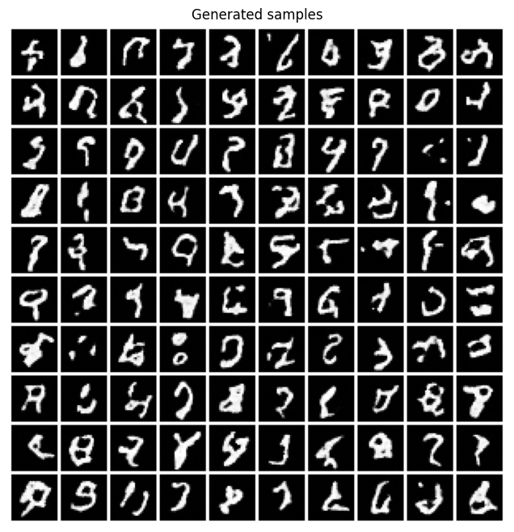
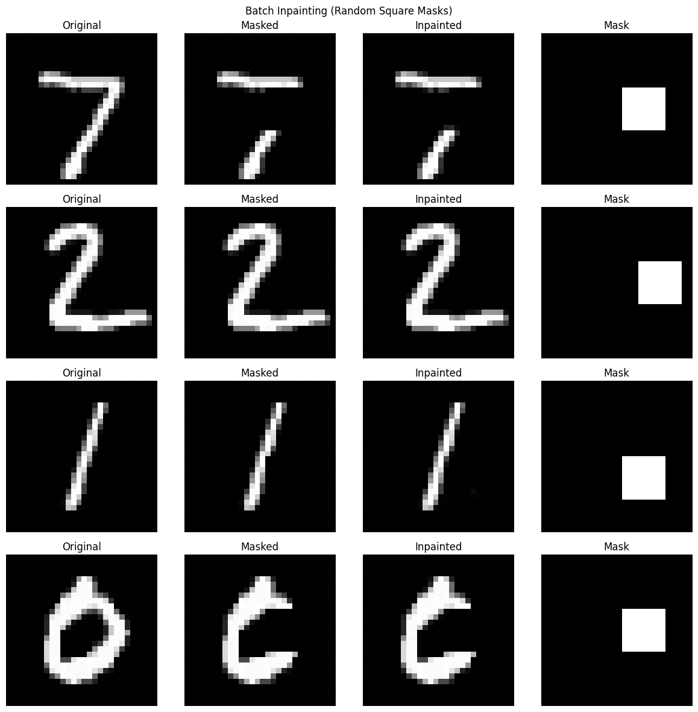

# Normalizing Flows: Density Estimation and Image Inpainting

This repository contains implementations of Normalizing Flow models for generative modeling. It demonstrates the power of invertible neural networks in two contexts: learning complex 2D distributions and performing image restoration (inpainting) on the MNIST dataset.
Normalizing Flows are a class of generative models that learn an exact likelihood by transforming a simple base distribution (usually a Gaussian) into a complex data distribution via a sequence of invertible mappings with computable Jacobian determinants.

## 2D Density Estimation

We implemented a flexible `Flow` container and trained two architectures on the "Make Moons" dataset.

### Algorithms

*   **RealNVP-style Flow:** Uses alternating binary masks and `InvertibleLinear` layers (1x1 convolutions) to mix features between coupling layers.
*   **Permutation Flow:** Uses fixed random `PermutationTransform` layers between coupling layers to ensure all dimensions interact.

### Process
1.  **Forward Pass ($x \to z$):** Data is passed through a sequence of invertible transforms. We accumulate the log-determinant of the Jacobian at each step.
2.  **Training:** We minimize the Negative Log-Likelihood (NLL): $-\log p(x) = -(\log p(z) + \sum \log |\det J|)$.
3.  **Sampling ($z \to x$):** Noise is sampled from the base Gaussian and passed through the inverse of the flow.

### Results (2D)

**Training Loss Comparison:**
> 
> *NLL decrease over epochs for RealNVP vs PermutFlow.*

**Density Estimation & Sampling:**
> 
> *2x2 grid showing learned density contours and generated samples for both models.*

---

## Image Inpainting with Glow

We utilized the `normflows` library to build a Multi-scale Flow architecture (similar to Glow) and trained it on the MNIST dataset.

### Methodology

**The Architecture:**
A multi-scale architecture that progressively splits dimensions to the latent space, using `GlowBlocks` (ActNorm + 1x1 Conv + Affine Coupling).

**The Inpainting Algorithm:**
Unlike Autoencoders or GANs which might require specific inpainting training, Flow models can perform inpainting zero-shot by leveraging the learned probability density function.

1.  **Masking:** We apply Random Square Masks or Random Noise Masks to test images.
2.  **Optimization:** We treat the missing pixels as trainable parameters ($\delta$).
3.  **Objective:** We freeze the model weights and the known pixels. We optimize $\delta$ to maximize the likelihood of the *entire* image under the trained model:
    $$ \hat{x}_{missing} = \arg\max_{\delta} \log p_{flow}(x_{known} + \delta \cdot M) $$
    where $M$ is the mask.

### Results (Inpainting)

**Generated Samples:**
> 
> 
**Batch Inpainting Results (Square Masks):**
> 

